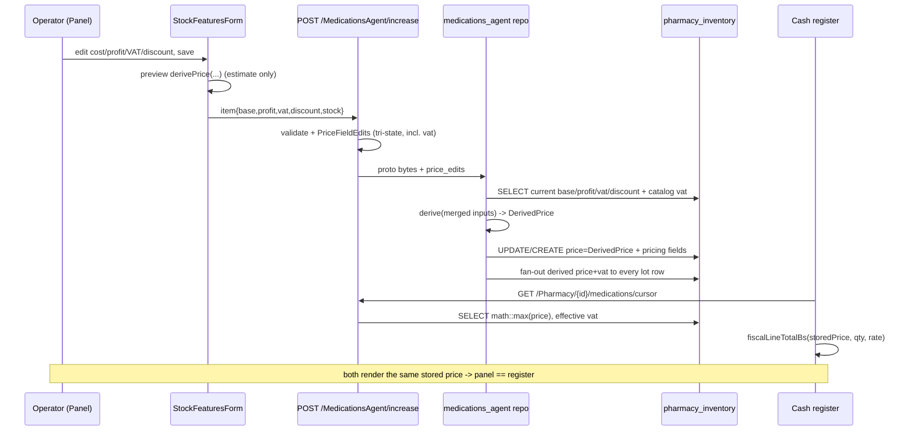
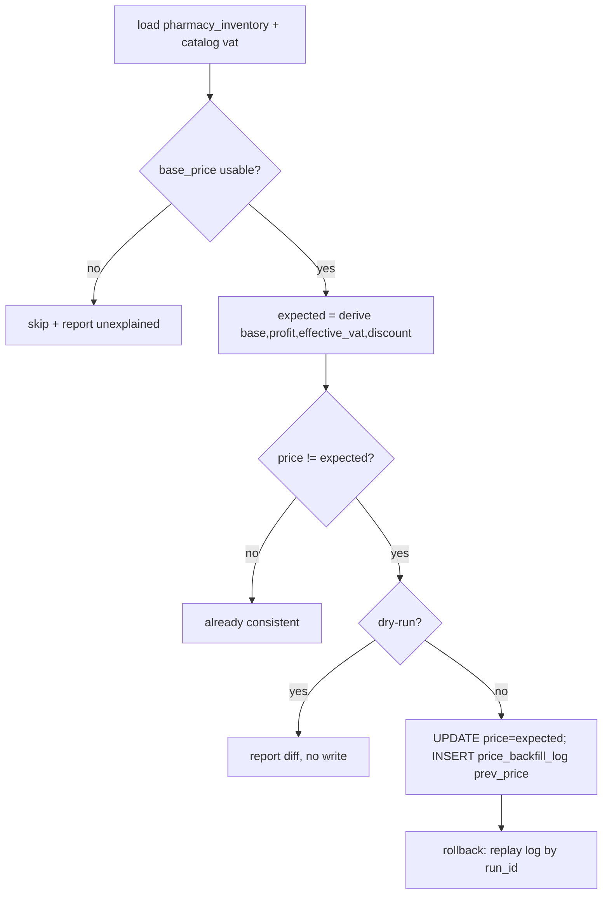

# Design: Fix Price Source Consistency

**Change**: `fix-price-source-consistency`
**Repos read (read-only)**: `ERP_medizin_web` @ `44d5ac9`, `Backend-administrativo` @ `2aa6eca7`
**Status**: design only — no source modified.

## Technical Approach

One pure derivation lives in the backend shared crate (`shape`, depended on by every feature) and is the only producer of the value bound to `pharmacy_inventory.price`. Every writer resolves the row's post-write inputs (`base_price`, `profit_percentage`, `vat`, `discount`) in Rust, calls the single function, and binds a `DerivedPrice` newtype. The listing already returns that stored value, so the panel and the register read the same number by construction. VAT becomes a per-pharmacy inventory input (tri-state, like the other pricing fields) with an explicit fallback chain. A reversible, dry-run backfill reconciles existing divergent rows.

Spec mapping: formula + VAT in `inventory-price-derivation`; writer coverage in the same capability + `inventory-price-persistence` (incl. the lot-carrying aggregate-consistency gate); VAT storage/DTO/proto in `inventory-pricing-fields`; per-lot in `inventory-lot-tracking`.

## Architecture Decisions

### D1 — Formula, ownership, rounding

**Choice**: `shape/src/pricing.rs` (new) owns:

```rust
pub struct DerivedPrice(f64);                 // only pricing::derive constructs it
pub const DEFAULT_VAT_PCT: f64 = 0.0;
pub fn effective_vat(inventory: Option<f64>, catalog: Option<f64>) -> f64; // inv -> catalog -> 0
/// None when base absent/non-positive. Err when profit/discount invalid.
pub fn derive(base: Option<f64>, profit: Option<f64>, vat: Option<f64>, discount: Option<f64>)
    -> Result<Option<DerivedPrice>, PriceInputError>;
```

`base_derived = (base / (1 - profit/100)) * (1 + vat/100)`; `price = round2(base_derived * (1 - discount/100))`; `round2(x) = (x * 100).round() / 100`. Absent `profit`/`discount` → `0`; absent `vat` → `effective_vat`; `profit` outside `[0,100)` or non-finite → `Err`; `discount` outside `[0,100)` → `Err`.

**Alternatives**: (a) keep a SurrealQL formula expression in each writer — duplicates the formula in a second language; (b) put the function in `medications_agent` — unreachable from the other five writers.

**Rationale**: `derived_selling_price` (`.../medications_agent/src/infrastructure/repositories.rs:114-125`) excludes VAT and lives where no other writer can import it; `purchase_invoices/.../create_invoice.rs:24-29` `precio_venta` is a third copy. `shape` is the only crate every writer already depends on. Rounding is once, at the end, so the FE parity vectors in `test/pricing.test.mjs:16-24` hold. `f64::round` vs `Math.round` differ only for negative inputs; prices are non-negative, so parity is total.

### D2 — `discount` participates in the persisted price (spec open decision (a))

**Choice**: Yes. `price` includes the discount.

| Option | Tradeoff | Decision |
|---|---|---|
| Include discount in `price` | Register keeps charging stored `price` unchanged; panel today already sends the discounted value | **Chosen** |
| Exclude discount, apply at charge time | Requires editing `current-order.store.ts`, `fiscal-totals.ts`, `money.ts`, printer payload | Rejected — fiscal flow is out of scope |

**Rationale (grounded)**: the register already treats the stored price as post-discount — `OrderItemsTable.tsx:86-88`, `ProductSearchDialog.tsx:124-127` and `PriceCheckDialog.tsx:67-71` all re-inflate it as `med.price / (1 - med.discount/100)` for display, and `fiscalLineTotalBs` (`fiscal-totals.ts:42`) charges `med.price` directly. `StockFeaturesForm.tsx:112` already sends `hasDiscount ? discountedPrice : priceWithVat`. **Consistency rule**: the register MUST NOT apply `discount` again; `discount` is an input to the persisted price only.

### D3 — VAT transport and authority (spec open decision (c))

**Choice**: VAT becomes a per-pharmacy inventory field, threaded through every write, with this fallback when deriving: **explicit inventory `vat` → catalog `products.vat` → `0`**. An explicit `0` is a value and never falls back (`StockFeaturesForm.tsx:46-48` already treats `0` as a valid option).

Transport, by path:
- JSON increase: `IncreaseMedicationItem` gains `vat: Option<Option<f64>>` (same `double_option` tri-state as `dto.rs:41-52`); `PriceFieldEdits` (`application/repositories.rs`) gains `vat`; `validate_price_fields` (`dto.rs:84-101`) validates it `>= 0` finite.
- Storage: `ModelInventory.vat` and `ModelMedicationsaux.vat` change `i64` → `Option<f64>` (`shape/src/models/model_medications.rs:147,208`). `ModelMedicationsaux` is the `/Medications/Create` DTO, so this is an API-visible nullability change.
- Listing: `RawInventoryRow` (`phamacy_action/.../repositories.rs:370-380`) gains `vat`; the grouped and fast SQL select it; `phamacy_action/.../repositories.rs:815` stops using `product.vat` and uses inventory-vat-or-catalog-fallback; the JSON `vat` output stays `i64` for FE compatibility.

**MQTT / proto — a proto change IS unavoidable and is flagged blocking.** CORRECTION: `medicationsagentdto.MedicationProto` **already has `double vat = 15`** (`Backend-administrativo/src/features/medications_agent/src/adapters/dto.proto:30`), matching `orderspharmacydto.MedicationProto`'s `double vat = 15` (`src/mqtt/src/adapters/pharmacy/dto.proto:39`). There is no free VAT slot to add; the real choice is presence, not a new field:
- **(i) change the existing field to `optional double vat = 15` (recommended).** Keeps the established wire number, mirrors the mqtt proto, and is backward-compatible for value decoding: proto3 `optional` has the same wire type/tag, and a consumer that reads field 15 as a non-optional double still sees the value (including an explicit `0`, which presence now forces onto the wire). This is the only option that gives the tri-state (`absent` / `null` / value) the spec requires.
- **(ii) keep `double vat = 15` non-optional and add a differently named optional field** (e.g. `optional double vat_explicit = 23`). Duplicates the VAT semantics on one message (two fields meaning VAT) and requires readers to prefer the new one; rejected as a maintenance trap.

**Publisher blast radius**: there are two code sites that build and publish `DtoUpdateMedications` to `pharmacy/{id}/insert_inventory` — `infrastructure/controllers/increase_inventory.rs:140-147` and `application/increase_inventory_orchestrator.rs:86`. The orchestrator file is **not compiled**: `application/mod.rs` declares only `repositories`, `use_cases`, `mappers` and never `pub mod increase_inventory_orchestrator`, so the file is dead code and the only *live* publisher is `increase_inventory.rs:140-147`. Consequence: this change must (a) set `vat` on the proto in the live controller, and (b) delete the dead orchestrator file (or, if it is ever wired, update it in the same commit) so a stale `MedicationProto` construction without VAT cannot resurface. The backend no longer subscribes to `pharmacy/{id}/insert_inventory` (`src/infra/src/mqtt_services.rs:82-83`), so decoders are external pharmacy clients; making field 15 optional changes no tag or wire type, so no existing decoder breaks. **Field presence choice still needs an explicit user ack before apply.**

**Known data consequence (must appear in backfill evidence)**: the Excel import already writes an explicit `vat = 0` on every created row (`.../medications_agent/.../repositories.rs:1276`). Per the tri-state rule those rows derive with VAT 0 and will ignore `products.vat`. This is spec-compliant (explicit zero wins) but changes their price; it is called out rather than silently "fixed".

### D4 — Enforcement: one choke point, not per-writer recompute

**Choice**: a single pure function plus a non-forgeable type. Every `price` bind in every `pharmacy_inventory` writer takes a `DerivedPrice`; the type is constructible only inside `shape::pricing`. A writer that tries to persist a raw user-entered price does not compile.

For tri-state partial writes the post-write inputs must be known, so each writer does a bounded resolve SELECT before composing its batch (target rows' `base_price/profit_percentage/vat/discount` + catalog `vat`). The increase path already queries the affected inventory rows (`.../repositories.rs:499-553`) and the catalog (`:401-426`); other writers add one `WHERE product_id IN [...]` read.

| Writer (file:line) | Change |
|---|---|
| increase CREATE `:320-334`, bind `:631-668` | resolve inputs; `price = DerivedPrice`; add `vat` to `new_inventory_set_clause` |
| increase UPDATE `:295-315`, bind `:670-711` | same; drop the `IF $pi > 0` preserve and omit `price` when `derive` returns `None` |
| no-lote propagation `:336-371`, `:719-752` | gate widened (see below); derive per row after merging the tri-state edits; set `price`/`vat` on every row |
| import CREATE `:1274-1291` | replace `derived_selling_price` with `derive`; stop hardcoding `vat = 0` (use effective vat) |
| import UPDATE `:1318-1338` | same |
| `batch_add_medications` `phamacy_action/.../repositories.rs:735-744` | row JSON adds `base_price/profit_percentage/vat/discount`; derive; absent inputs → reject the row into `skipped` |
| purchase invoice `purchase_invoices_impl.rs:122-166` | invoice `precio_unitario` → `base_price`; persist `profit_percentage/vat/discount`; `price = derive` (replaces `precio_venta`) |
| delivery note `delivery_note/.../repositories.rs:518-529` | **blocked by D5** |
| catalog create `repositories_products.rs:264-381` | FE stops sending `basePrice/profitPercentage` to `/Medications/Create`; pricing is routed by `useCreateProduct.ts:94-121` / `products.store.ts:356-369` via `increaseInventory`, and the no-op skip is made impossible by adding `vat` to `PricingSnapshot` |

**Proof no writer bypasses it**: (1) the `DerivedPrice` newtype makes a raw-price bind a compile error; (2) a repo-wide `#[test]` scans `.rs` sources for `pharmacy_inventory` statements that name `price =` without a `DerivedPrice` bind and fails otherwise. Read paths (`math::max(price)` `:872,:942`, `valor_venta` `:981`, movement snapshot `:173`, `pharmacy_search:276`) are untouched (LOT-REQ-006 frozen).

**Lot-carrying writes (closes `inventory-lot-tracking` "Lot write decreases the aggregated price" and `inventory-price-persistence` "Lot-carrying decrease is visible").** The existing gate `should_propagate_price(lote, price) = no_lote && price > 0` (`:270-273`, applied `:624-628`) is **replaced** by `should_propagate_pricing(edits, lote, price)`: fan out when the write sets or clears at least one derivation input (`base_price`, `profit_percentage`, `vat`, `discount`) **regardless of the lot label**, or, as the legacy case, when it is a no-lote write with `price > 0`. A lot-carrying write that carries no derivation-input edit (a pure lot stock add) does not fan out and leaves the product price unchanged. When it does fan out, the writer merges the tri-state edits into each row's stored inputs, calls `derive` per row, and writes the resulting `price` + `vat` to every row — so a lot-carrying pricing write that lowers the derivation lowers `math::max(price)` too. The target lot row is covered by the same fan-out, so no row is left stale.

Consequence for `math::max(price)` consumers (semantics unchanged, LOT-REQ-006): after any product-level pricing write every lot row of the product shares the same derived price, so `valor_venta` (`:981`), the movement snapshot (`inventory_movements/.../repositories.rs:173`), the PDF report and `low_stock` all read one consistent value instead of a stale maximum. Per-lot rows written by purchase invoices/delivery notes keep their own derived price until the next product-level pricing write — that overwrite is the accepted product-level-intent override carried from the prior change (`archive/2026-09-25-fix-product-price-update/design.md:224`). New RED tests must cover: a pricing write carrying a lot label lowers the aggregate; a pure lot stock add leaves the aggregate unchanged; the target row itself is never stale.

### D5 — Per-lot semantics (spec open decision (b))

| Path | Evidence | Decision |
|---|---|---|
| Purchase invoice `precio_unitario` | `create_invoice.rs:24-29` already derives a sale price from it (`precio_venta`); `CreateInvoiceItemDto.profit_percentage` doc says "used to derive the inventory sale price" (`.../adapters/dto.rs:63-64`) | **Per-lot acquisition cost** (spec default) |
| Delivery note `precio_unitario` | No derivation exists; `load_delivery_note_inventory` defaults it to the current inventory **sale** price (`delivery_note/.../repositories.rs:642`) and the document total is `precio * cantidad`; `receptor`/`recibido_por` make it an outgoing document | **RESOLVED (user, D5): delivery notes are EXCLUDED from the invariant** — a delivery-note lot write MUST NOT derive the inventory price; purchase invoices keep the per-lot acquisition-cost derivation |

Delivery-note options and blast radius:
- **(1) Product-level intent (recommended)**: ignore the line price for inventory pricing; write stock only, leave `price`/inputs to the product-level derivation. Blast radius: the delivery note's own PDF/detail still shows the entered price (document-only), inventory pricing unaffected. Lowest risk, keeps the invariant.
- **(2) Acquisition cost (spec's default wording)**: interpret the line price as a cost and derive. Blast radius: double-derives an already-sale price → systematically **inflates** every delivery-note lot row and, via `math::max(price)`, the product's charged price. Evidence contradicts this.
- **(3) Explicit sale-price override**: `base_price = costFromPrice(linePrice, profit, vat)` so the derivation reproduces the entered price. Blast radius: coherent, but makes the delivery note a second pricing authority next to the product panel.

The `inventory-lot-tracking` spec is narrowed to purchase invoices: delivery notes are an explicit non-goal (D5, resolved by the user).

### D6 — Frontend alignment

- Single FE derivation in `modules/products/lib/pricing.ts`: add `derivePrice(base, profit, vat, discount)` = `round2(sellingPrice(base, profit ?? 0, effectiveVat(vat)) * (1 - (discount ?? 0)/100))` and export `DEFAULT_VAT_PCT = 0`. `sellingPrice` keeps its current math (already VAT-inclusive, `:11`); `bulkSellingPrice` becomes a thin wrapper so the `?? 0` lives in one named constant.
- `TabCreateProduct.tsx:275,288` the `parseInt(vat)`-based coercion (which collapsed an explicit `0` and blanks into the hardcoded default) becomes `parseVatInput(formData.vat)` returning `0` for `"0"` and `undefined` for blank; the default is now `0`.
- `StockFeaturesForm.tsx`: render the persisted `currentMedicine.price` as the charged price (`Precio Final (cobrado)`, USD + Bs via `toBs2(price * rate)`), label the live derivation as a preview only; after save, reload the listing so `currentMedicine` carries the backend-derived value. Remove the local `handleSubmit` price authority so the FE never sends a price that competes with the derivation.
- `PricingSnapshot`/`buildIncreaseItem` (`modules/products/lib/inventory-write.ts:18-24,104-143`) gain `vat`, and `pricingChanged` (`:71-78`) compares it, closing the "VAT edit changes nothing to write" hole.
- `test/pricing.test.mjs:44` becomes an explicit two-line contract: absent VAT → `14.29` (documented `0` default), and **new** `bulkSellingPrice(10, 30, 0) === 14.29` (explicit zero is not coerced). Shared parity vectors: `(0.8,40,0,0)→1.33`, `(0.8,40,16,0)→1.55`, `(10,30,16,0)→16.57`, `(10,0,16,0)→11.60`, `(0.8,40,0,10)→1.20`, `(10,30,16,10)→14.91`.

### D7 — Backfill

Sidecar table (no schema change to the hot table, reversible):
`price_backfill_log { id, run_id, row_id, prev_price, new_price, base_price, profit, vat, discount, created_at }`.

Algorithm: load rows + catalog `vat`; if `base_price` absent/`<= 0` → skip and report; else `expected = derive(...)`; if `|price - expected| > 1e-9` it is divergent. Dry-run reports `{total, divergent, skipped_null, consistent}` + a row diff and writes nothing. Apply: `UPDATE pharmacy_inventory SET price = $expected` and `INSERT price_backfill_log` in the same transaction. Rollback: replay the log backwards for a `run_id`. Idempotent: a second run finds zero divergent rows.

Surface: a `price_backfill` bin in the `http` crate (`--dry-run` default, `--apply`, `--rollback`, `--run-id`), plus `#[ignore]` tests. Acceptance evidence: `divergent_before`, `reconciled_after`, `unexplained = 0`, and `rollback` restoring exact prior values. A one-time data fix for the `vat = 0` import rows (D3) is explicitly **not** part of this backfill; it is reported.

### D8 — Rollout / migration

No silent data change. Order: (1) BE derivation + VAT contract, (2) snapshot rehearsal → backfill dry-run → apply, (3) FE alignment. BE first is safe: the increase DTO is additive (unknown JSON fields are ignored), and until the backfill no stored data changes. Production verification is read-only: `GET /admin/Pharmacy/{id}/medications/cursor?query=<barcode>` before/after and compare `price` with the recorded derivation inputs. Rollback: revert both PRs and replay the `price_backfill_log`; read semantics were never changed so old code reads the restored values.

## Data Flow

Write path:



Backfill:



## File Changes

| File | Action | Description |
|---|---|---|
| `Backend/src/shape/src/pricing.rs` + `lib.rs` | Create/Modify | `derive`, `DerivedPrice`, `effective_vat`, `DEFAULT_VAT_PCT` |
| `.../medications_agent/.../repositories.rs` | Modify | 5 writer sites + propagation use `derive`; resolve inputs; VAT in SET |
| `.../medications_agent/.../adapters/dto.rs` | Modify | `IncreaseMedicationItem.vat` tri-state; validate; `PriceFieldEdits.vat` |
| `.../medications_agent/.../adapters/dto.proto` | Modify | `double vat = 15` → `optional double vat = 15` |
| `.../medications_agent/.../application/increase_inventory_orchestrator.rs` | Delete (or wire + update) | Dead duplicate publisher (not in `application/mod.rs`); consolidates the single live proto builder |
| `.../medications_agent/.../increase_inventory.rs` | Modify | map `vat` into the proto + `price_edits` |
| `.../medications_agent/.../infrastructure/controllers/increase_inventory.rs` | Modify | (orchestrator duplicate) carry `vat` |
| `.../shape/src/models/model_medications.rs` | Modify | `ModelInventory/ModelMedicationsaux.vat: Option<f64>` |
| `.../phamacy_action/.../repositories.rs` | Modify | listing reads inventory vat with fallback; `batch_add` derives |
| `.../medications/.../repositories_products.rs` | Modify | catalog create stops accepting pricing silently (FE stops sending) |
| `.../purchase_invoices/.../purchase_invoices_impl.rs`, `create_invoice.rs` | Modify | per-lot inputs persisted; `derive` replaces `precio_venta` |
| `.../delivery_note/.../repositories.rs` | Modify | **after D5 is answered** |
| `Backend/src/http/src/bin/price_backfill.rs` + `Cargo.toml` | Create/Modify | dry-run/apply/rollback CLI |
| `Backend/src/http/src/price_backfill_e2e.rs` | Create | snapshot-proven dry-run + rollback tests |
| `modules/products/lib/pricing.ts`, `inventory-write.ts` | Modify | unified `derivePrice`, `DEFAULT_VAT_PCT`, `vat` in snapshot |
| `modules/products/components/StockFeaturesForm.tsx`, `TabCreateProduct.tsx` | Modify | charge stored price; `parseVatInput`; remove price authority |
| `modules/products/store/products.store.ts`, `hook/useCreateProduct.ts`, `api/products.service.ts` | Modify | `vat` in payloads; drop catalog pricing fields; explicit routing |
| `test/pricing.test.mjs`, `test/inventory-write.test.mjs`, `test/products-store.test.mjs` | Modify | parity vectors, explicit-zero, `vat` in `shouldWriteInventory` |
| `Backend/src/http/src/price_propagation_e2e.rs` | Modify | assert listing `price` == `derive(...)` and `vat` |

## Interfaces / Contracts

```rust
// shape/src/pricing.rs
pub const DEFAULT_VAT_PCT: f64 = 0.0;
pub struct DerivedPrice(f64);
impl DerivedPrice { pub fn value(self) -> f64 { self.0 } }
pub enum PriceInputError { InvalidProfit(f64), InvalidDiscount(f64), NonFiniteBase }
pub fn effective_vat(inventory: Option<f64>, catalog: Option<f64>) -> f64;
pub fn derive(base: Option<f64>, profit: Option<f64>, vat: Option<f64>, discount: Option<f64>)
    -> Result<Option<DerivedPrice>, PriceInputError>;
```

```ts
// modules/products/lib/pricing.ts
export const DEFAULT_VAT_PCT = 0;
export function derivePrice(base?, profit?, vat?, discount?): number | undefined;
export function parseVatInput(raw: string): number | undefined; // "" -> undefined, "0" -> 0
```

JSON increase item gains `"vat": <number | null>`; omitted = keep, `null` = clear, number = set (including `0`).

## Testing Strategy

| Layer | What | How |
|---|---|---|
| FE unit | parity vectors, explicit-zero VAT, discount in the price, `vat` in `shouldWriteInventory` | `npm run test:pricing`, `test:inventory`, `test:store` |
| FE unit | displayed charge price equals the stored price; register source is the same value | extract a pure `displayedChargePrice(med)` helper and assert it and `fiscalUnitPriceBs(med.price, rate)` both read `med.price` |
| BE unit | `derive` vectors identical to the FE list; `effective_vat` fallback chain; invalid profit/discount rejected; `DerivedPrice` is the only price constructor | `cargo test -p shape`, `cargo test -p medications_agent`, `-p phamacy_action` |
| BE unit | no-bypass source scan (README/DESIGN: `price =` in a `pharmacy_inventory` statement must bind a `DerivedPrice`) | `cargo test -p http` |
| BE DB (`#[ignore]`) | each writer persists the derived value; partial tri-state; fan-out down/up; lot-carrying pricing write lowers the aggregate; pure lot stock add does not; target row not stale; import `vat = 0` respected | `medications_agent/src/test.rs` harness |
| BE E2E (real SurrealDB) | panel==register: increase with VAT → cursor listing returns `price == derive(...)`, and that value is what `fiscalLineTotalBs` consumes | extend `src/http/src/price_propagation_e2e.rs` |
| Backfill | dry-run reports, apply reconciles, rollback restores exact prior values, NULL inputs skipped | `src/http/src/price_backfill_e2e.rs` on a snapshot |

## Threat Matrix

N/A — no routing, shell, subprocess, VCS/PR automation, executable-file classification, or process-integration boundary.

## Migration / Rollout

See D8. Backfill is dry-run-first, snapshot-rehearsed, reversible via `price_backfill_log`, and never runs inside a deploy. BE deploy precedes the backfill; FE deploy follows. Production verification is a read-only cursor query before/after.

## Resolved Decisions (previously blocking)

- [x] **Delivery-note per-lot price (D5)** — RESOLVED (user): delivery notes are EXCLUDED from the invariant. A delivery-note lot write MUST NOT derive the inventory price (its `precio_unitario` defaults to the current inventory sale price, so deriving would double-count/inflate it). Purchase invoices keep the per-lot acquisition-cost derivation.
- [x] **Proto VAT presence (D3)** — RESOLVED (user): make the existing field `optional double vat = 15` (same tag and wire type; presence for the tri-state). Implemented in Slice 2; the dead `increase_inventory_orchestrator.rs` was deleted in Slice 1.
- [x] **Import `vat = 0` rows (D3/D7)** — RESOLVED: report only. The backfill CLI surfaces these rows (`explicit_vat_zero` + a `REPORT ONLY` line) and never changes them silently.

## Open Questions

- [ ] Value/meaning of `11` and `7Frasco` in the panel screenshot (verification input; resolve against real rows at apply).
- [ ] The concrete `BOTELLON DE AGUA RECARGA` row inputs — needed to confirm the 1.55 provenance during apply.
- [ ] Single shared vector fixture across the two repos is impossible (separate repos); duplicated vectors stay in sync by review.

## Size / Delivery

Exceeds the 400-line review budget (BE writers + proto + VAT contract + FE + backfill). `delivery_strategy = auto-chain`, `chain_strategy = stacked-to-main`; suggested slices: (1) `shape::pricing` + BE writers, (2) VAT transport (DTO/proto/listing) **after the D5/D3 answers**, (3) FE alignment/surface, (4) backfill CLI + E2E.

## Key Learnings

1. The register already treats stored `price` as post-discount, proving discount belongs inside the persisted derivation.
2. The purchase-invoice path already derives a sale price from cost with `precio_venta`, which grounds the per-lot acquisition-cost semantics.
3. The Excel import writes an explicit `vat = 0` on inventory rows, so per-pharmacy VAT fallback must respect explicit zero.
4. `medicationsagentdto.MedicationProto` already reserves `double vat = 15`, so the proto fix is a presence change (`optional`), not a new field, and cannot break existing decoders.
5. The `increase_inventory_orchestrator.rs` publisher is dead code (absent from `application/mod.rs`), so only one live MQTT publisher exists.
6. A `DerivedPrice` newtype in a shared crate is the cheapest way to make "no writer can bypass the invariant" a compile-time guarantee.
7. The lot-carrying propagation gate must be widened or `math::max(price)` stays stale when only a lot row is written; a pure lot stock add must still not fan out.
