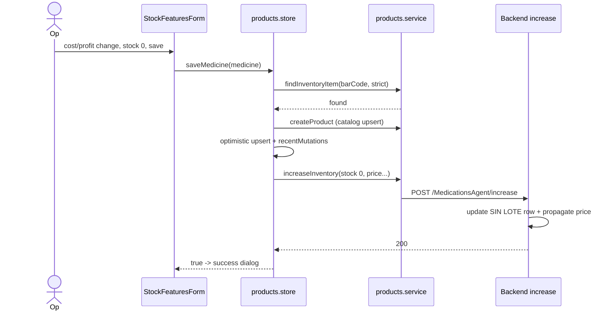
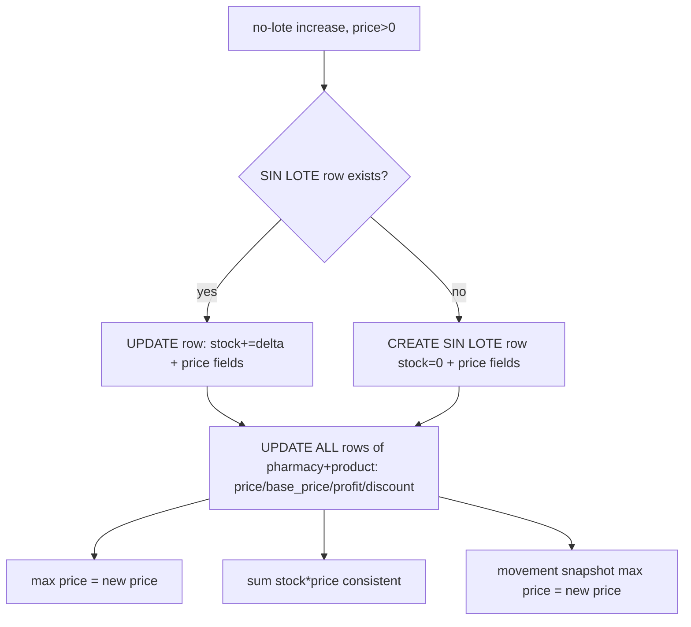

# Design: Fix Product Price Update

## Technical Approach

Four root causes (A/B/D frontend, C backend). A/B/D are contract fixes inside
`modules/products/` plus a pure, unit-testable helper layer. C is resolved as **write
propagation**, the only direction that keeps every consumer consistent with one write
change; a read-semantics change would touch 4+ read sites and still leave row-level
consumers divergent. No new endpoint, no schema migration.

## Architecture Decisions

### Decision 1 — Root cause C direction: write propagation (option i)

**Choice**: On a no-lote `increase` item (`lote == None`, `price > 0`), after the existing
insert/update, propagate the price scalars to **all** `pharmacy_inventory` rows of
`(pharmacy_id, product_id)`.
**Alternatives**: (ii) read semantics — pick the most recently updated row's price in the
listing.
**Rationale**: one write site vs. read edits at `phamacy_action/.../repositories.rs:551`,
`:872`/`:942`, `:1077`, `inventory_movements/.../repositories.rs:173`,
`pharmacy_search/.../repositories.rs:276`, and `:981`. Read-only fixes the display but leaves
`valor_venta` (`math::sum(stock*price)`, row-level) and per-row delivery price divergent, which
the spec forbids ("reporting consumers reflect the same price"). It also preserves `max(price)`
/ LOT-REQ-006 semantics.

**Consumer evidence** (does propagation break it?):

| Consumer | Site | Reads | Effect |
|---|---|---|---|
| Cursor listing (slow) | `phamacy_action/.../repositories.rs:872` | `max(price)` | new price |
| Cursor listing (fast, Rust) | same `:942` `agg.price.max(r.price)` | max | new price |
| Legacy list | same `:551` | `max(price)` | new price |
| Catalog enriched search | same `:1077` | `max(price)` | new price |
| `resumen.valor_venta` | same `:981` | row-level `sum(stock*price)` | = new_price × total_stock (consistent, no error) |
| `low_stock` | same `:990-995` | `sum(stock)`, `max(minimum)` — **no price** | provably unchanged |
| Movement snapshot `precio_antes` | `inventory_movements/.../repositories.rs:173` | `max(price)` | new price |
| Delivery search | `pharmacy_search/.../repositories.rs:276` | per-row `price` | all rows = new price |
| POS / price-check / PDF | FE `PriceCheckDialog.tsx:19`, `ProductSearchBar.tsx:97`, `ManualAddDialog.tsx:24`, `TabInventory.tsx:129-213` | cursor `max(price)` | new price |

### Decision 2 — Propagation scope and field set

**Choice**: propagate `price`, `base_price`, `profit_percentage`, `discount`; never `stock`,
`minimum`, `lote`, `fecha_vencimiento_lote`. Scoped to no-lote writes; gated on `price > 0`.
**Alternatives**: also propagate `minimum`; also overwrite `stock`.
**Rationale**: propagation does not touch `minimum`, so `low_stock` — computed as
`math::sum(stock)` vs `math::max(minimum)` at `phamacy_action/.../repositories.rs:990-995` — is
unchanged for **price-only** edits. `minimum` is a stock threshold, not price semantics. `stock`
must stay additive and only on the targeted row. The `price > 0` guard preserves the `price = 0`
contract (`medications_agent/.../repositories.rs:527`).

### Decision 3 — Root cause B: authoritative server resolution

**Choice**: `findInventoryItem` (`products.store.ts:210`) is the right authoritative source
(server cursor `query=barCode`). Add `opts?: { strict?: boolean }`: on request failure it
**rethrows** instead of returning `null` (`:223-225`); default stays `null`-on-miss so the
three read-only consumers (`PriceCheckDialog`, `ManualAddDialog`, `ProductSearchBar`) are not
displaced. `saveMedicine` calls it `strict` and branches:

- `found` → `createProduct` upsert + `increaseInventory` **when the save is meaningful**:
  `stockDelta ≠ 0` **or** a pricing field changed. A lot-only edit (zero stock, no pricing
  change) and a pure no-op **skip** the write so no `increaseInventory` call — and therefore no
  backend propagation — fires (`inventory-lot-tracking/spec.md:24-27`).
- `missing` → `createProduct` + `increaseInventory` when `stockDelta ≠ 0` or `hasPricing`.
- `error` → return `false` immediately, no write, no optimistic update.

"Pricing changed" compares the submitted absolute values against the **server-resolved** item
(never against a stock delta), replacing the broken delta-vs-absolute compare at
`products.store.ts:323-327`.

### Decision 4 — Root cause A: ungating, per call site

**Choice**: remove the `quantityVal > 0` gate (`useCreateProduct.ts:92`) and the
`stock > 0` filter (`BulkImportDialog.tsx:225-227`). For the genuinely-new (`missing`) path,
`hasPricing = price > 0 || minimum > 0 || basePrice != null || profitPercentage != null
|| discount != null`; `minimum` is meaningful when **non-zero**, not by mere presence, since the
forms always send a `minimum` default (`useCreateProduct.ts:65`). `stock` is a delta in all
three; it never gates.

**`saveMedicine` decision table** (`found` = server-resolved; pricing-changed compares absolute
values against the server item):

| `stockDelta` | pricing changed? | lot changed? | Action |
|---|---|---|---|
| `≠ 0` | any | any | `increaseInventory` with delta + price fields; trimmed `lote`/expiry only if `delta > 0` (`inventory-lot-tracking/spec.md:9-12`) |
| `0` | yes | any | `increaseInventory` with `stock: 0` + price fields; **omit** `lote` (`inventory-lot-tracking/spec.md:19-22`) |
| `0` | no | yes | **skip** — a lot alone is not an idempotent attribute (`inventory-lot-tracking/spec.md:24-27`) |
| `0` | no | no | **skip** (pure no-op) |

For `missing`, "pricing changed" is replaced by `hasPricing`; the action collapses to
`stockDelta ≠ 0 || hasPricing`.

| # | Call site | Call when | `stock` |
|---|---|---|---|
| 1 | `useCreateProduct.ts:93` | `pharmacyId && barCode && (qty>0 || hasPricing)` | delta; lote/expiry only if `qty>0` |
| 2 | `products.store.ts:329` | `found` → per decision table; `missing` → `stock≠0 || hasPricing` | delta |
| 3 | `BulkImportDialog.tsx:234` | row `stock>0 || hasPricing` | delta |

Remove the broken delta-vs-absolute `changed` compare (`products.store.ts:323-327`).
Bulk "no stock > 0" warning (`:229`) becomes "no stock/pricing".

### Decision 5 — Error surfacing

**Choice**: `saveMedicine` captures pre-save `inventory`, applies the optimistic upsert, awaits
`increaseInventory`; on throw it **reverts** `inventory` and returns `false` (replaces the
swallow at `:342-344`). `StockFeaturesForm.handleSave` already handles `false` → error feedback,
no success dialog, form stays open (`:130-132`).
**Alternative**: `{ok,error}` object — rejected to keep the `Promise<boolean>` contract for its
single consumer.

### Decision 6 — Root cause D: echo reconciliation

**Choice**: `saveMedicine` sets `recentMutations[barCode] = Date.now()` when it optimistically
applies a stock delta. In `MqttInventoryProvider` insert/update (`:114-131`), if
`now - recentMutations[barCode] <= 5000` the handler applies only price/metadata (`:127`) and
**skips** `stock: (existing?.stock ?? 0) + quantity` (`:126`); otherwise it adds as today. Reuses
the existing mutation-window pattern from the decrease handler (`:141-148`).
**Tradeoff**: a concurrent remote add inside the 5s window is missed until refresh (pre-existing).

## Data Flow





## File Changes

| File | Action | Description |
|---|---|---|
| `modules/products/lib/inventory-write.ts` | Create | pure `shouldWriteInventory`, `buildIncreaseItem`, `mergeEcho` helpers |
| `modules/products/store/products.store.ts` | Modify | strict resolve, meaningful-change write (skip lot-only/no-op), rollback+`false`, `recentMutations`, drop `changed` |
| `modules/products/hook/useCreateProduct.ts` | Modify | ungate link; surface link failure |
| `modules/products/components/BulkImportDialog.tsx` | Modify | pricing-aware link filter + warning |
| `modules/products/providers/MqttInventoryProvider.tsx` | Modify | skip echo stock add within mutation window |
| `modules/products/api/products.service.ts` | Unchanged | `increaseInventory` already accepts all pricing fields (`:196`); only call sites change |
| `test/inventory-write.test.mjs` + `package.json` | Create/Modify | `test:inventory` script |
| `Backend-administrativo/src/features/medications_agent/src/infrastructure/repositories.rs` | Modify | add propagation batch after `:518-557` |
| `Backend-administrativo/src/features/medications_agent/src/test.rs` | Modify | multi-lot/single-lot DB tests |
| `Backend-administrativo/docs/api/MedicationsAgent.md` | Modify | document no-lote propagation |
| `phamacy_action`, `inventory_movements`, `pharmacy_search` repos | Read-only | no change needed |

**Affected-area reconciliation** (proposal Affected Areas → design File Changes):
- `products.service.ts` — proposal lists it Modified; design makes **no change**: the existing
  `increaseInventory` signature (`:196`) already carries every pricing field. The change is at
  the call sites, not the service. Tasks should treat it as read-only.
- `lib/inventory-write.ts`, `test/inventory-write.test.mjs`, `package.json` — **added** beyond the
  proposal to make A/B/D unit-testable without React (no such test surface exists today; the repo
  only has `test:pricing`/`test:fiscal` on pure Node).
- `docs/api/MedicationsAgent.md` — **added** because `modify-products/SKILL.md:24` mandates
  keeping the HTTP contract doc aligned with the code; the propagation changes that contract.

Propagation SurrealQL (mirrors existing binds `$php/$phb/$prp/$prb`):

```sql
UPDATE pharmacy_inventory SET price = $pi, base_price = $bpi,
  profit_percentage = $ppi, discount = $di, updated_at = time::now()
WHERE <string>pharmacy_id IN [$php, $phb]
  AND <string>product_id IN [$prp, $prb];
-- executed only for items with lote = NONE and price > 0
```

## Interfaces / Contracts

- `findInventoryItem(barCode: string, opts?: { strict?: boolean }): Promise<Medication | null>` (strict rethrows on request error).
- `increaseInventory` request DTO (`increase_inventory.rs:78-101`, `dto.rs:18-39`) unchanged; response unchanged.
- FE helpers return plain data so they run under `node --test` with no React.

## Testing Strategy

| Layer | What | Approach |
|---|---|---|
| FE unit | A/B: meaningful-change write for existing, price-only (stock 0), genuine new, lot-only **skip**, lot omitted on zero delta, additive stock | `test/inventory-write.test.mjs` (`npm run test:inventory`) |
| FE unit | D: echo within 5s does not double-add | same file, `mergeEcho` |
| BE unit | propagation SQL shape: no `lote =` filter, gated on price>0; `low_stock` SQL references no price | `cargo test -p medications_agent`, `-p phamacy_action` (string tests like `:1690-1707`) |
| BE DB (`#[ignore = "requires SurrealDB"]`) | multi-lot lower→listing returns new price; single-row; price=0 preserved; stock-add additive; import-stock still lote-scoped | `medications_agent/src/test.rs` via `run-rust-tests` / `write-rust-tests` |
| E2E manual | `GET /admin/Pharmacy/{id}/medications/cursor?query=<barCode>` returns new price after refresh | spec success criterion |

## Threat Matrix

N/A — no routing, shell, subprocess, VCS/PR automation, executable-file classification, or
process-integration boundary.

## Migration / Rollout

No migration, no new index, no feature flag. The `increase` contract is backward-compatible;
other callers (bulk import, purchase invoices, decrease) are untouched because propagation only
runs for no-lote items with `price > 0`. Existing divergent multi-lot rows self-heal on the next
product-level edit; an optional one-off backfill is deferred (see open questions). Revert both
PRs; snapshot pre-edit rows before applying C.

## Open Questions

- [ ] Propagate `minimum` across lots too? Left row-scoped to keep `low_stock` unchanged.
- [ ] Concurrent remote stock add inside the 5s echo window is missed until refresh — accept?
- [ ] Backend `import-stock` (`repositories.rs:1123`) has the same latent max/row divergence; in scope?
- [ ] No-lote price edit overwrites per-lot prices set by purchase invoices (`purchase_invoices_impl.rs:129-160`) — accepted as product-level intent?
